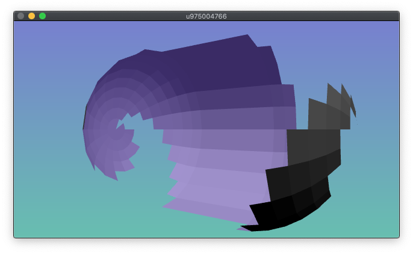

Index Array API
===============

Overview
--------

Index Array API is for use with the visual programming language Max. Written in JavaScript, this API is for generating and filtering the `jit.gl.mesh` index array, enabling you to control the visibility of each face of a surface.

Documentation & Usage
---------------------

The source code has complete documentation, and `index_array.maxpat` is an example implementation.

License
-------

Index Array API is available under the [BSD 2-Clause License](https://opensource.org/licenses/BSD-2-Clause).

Copyright
---------

© [Gregory Lee Newsome](http://gregoryleenewsome.ca/) 2020
